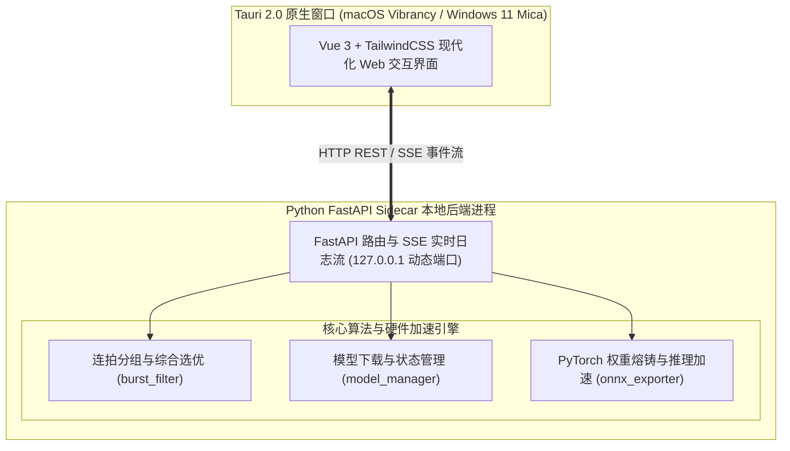

# Photo Sort

[](https://github.com/luqie0106/photo_sort/releases)
[](https://tauri.app/)
[](https://vuejs.org/)
[](https://fastapi.tiangolo.com/)
[](https://www.python.org/)
[](https://onnxruntime.ai/)
[]()
[]()
[](LICENSE)

本地连拍照片智能筛选与审美优选工具（Tauri 2.0 + Python FastAPI Sidecar 现代化架构）。

专为高频连拍场景（航空、体育、人像、生态等）设计，自动根据拍摄时间与画面相似度对连拍进行分组，结合局部清晰度（人脸优先）、曝光以及本地 AI 模型选出每组中的最佳照片，并将多余废片整理到审查目录。

---

## 🏗️ 架构设计

PhotoSort 2.0 采用 **Tauri 2.0 (Rust) + Vue 3 前端 + Python FastAPI Sidecar 后端** 架构：



- **轻量原生外壳**：Tauri 2.0 驱动原生窗口，占用内存极低，原生支持 macOS 磨砂效果与 Windows Mica 材质；
- **响应式通信**：前端通过 SSE (Server-Sent Events) 与本地 FastAPI 进程建立单向流式连接，毫秒级更新计算进度与终端日志；
- **双模启动兼容**：开发阶段自动调度 Conda/系统 Python 解释器；生产打包时无缝切换为 PyInstaller 独立 Sidecar 二进制执行文件。

---

## 主要功能

- **连拍自动分组**：结合 EXIF 亚秒级拍摄时间（1.5秒）与 dHash 图像感知哈希，自动识别同一连拍序列。长距离追焦移镜时，画面发生明显变化会自动拆分子组；三脚架定机位摆拍不会因时间不同被误合并。
- **RAW + JPG 伴生双文件智能绑定**：自动识别相机同拍伴生文件（如 `_DSC0001.ARW` + `_DSC0001.JPG`、`IMG_0001.CR2` + `IMG_0001.JPG` 等）并视为单次快门实体。单拍不会被误判为连拍组；连拍优选时优胜快门的 RAW 与 JPG 同时保留，淘汰快门的 RAW 与 JPG 同步移动，绝不拆散。
- **多维度选优打分**：
  - **清晰度（人脸优先）**：自动检测人脸区域并计算 Laplacian 梯度；无人脸时以画面中心主体区域为主。
  - **曝光评估**：统计直方图高光与暗部，对高光过曝（死白）施加惩罚。
  - **AI 美学与构图打分（可选）**：基于本地 CLIP 视觉特征，量化整体构图与美感。
- **个人审美偏好微调**：内置轻量训练器，只需提供 `like` 和 `dislike` 两个文件夹，即可在本地训练自己的审美模型，并一键导出为 ONNX 格式调用 NPU / GPU 硬件加速。
- **全格式支持**：
  - **相机 RAW**：Adobe DNG (`.DNG`，含大疆无人机/徕卡/Apple ProRAW/理光GR/宾得)、佳能 (`.CR2`/`.CR3`/`.CRW`)、松下/徕卡 (`.RW2`/`.RAW`)、尼康 (`.NEF`/`.NRW`)、索尼 (`.ARW`/`.SRF`/`.SR2`)、富士 (`.RAF`)、奥林巴斯 (`.ORF`)、宾得 (`.PEF`) 等。
  - **高效率格式**：索尼/佳能 10-bit `.HIF`、苹果 `.HEIC`/`.HEIF`、JPEG XL (`.JXL`)。
  - **通用格式**：`.JPG`、`.JPEG`、`.PNG`、`.WebP`、`.TIFF`、`.BMP`。
- **安全与非破坏性**：只读取元数据与缩略图，不修改原片，淘汰的照片移动到同目录下的 `审查_连拍淘汰` 文件夹，方便随时人工复查。

---

## 💡 核心概念与算法参数通俗释义

为了方便摄影师理解，以下对程序中涉及的技术术语与调节参数进行通俗说明：

| 术语 / 参数 | 通俗含义 | 推荐设置与调节建议 |
| :--- | :--- | :--- |
| **汉明距离 (dHash 构图容差)** | **画面结构相似度**。算法将照片压缩为 64 位结构指纹，汉明距离代表两张照片构图指纹**不同的位数**（取值 1~64）。 | · **默认值 12**：适合绝大多数手持常规连拍。<br>· **调小（6~8）**：对构图要求极严格，轻微移镜即拆分组（适合三脚架定点摆拍）。<br>· **调大（16~20）**：允许奔跑追焦、大幅度甩镜头仍聚在同一连拍组。 |
| **连拍时间间隔 (秒)** | **连拍判定时间窗口**。相邻快门在 EXIF 亚秒时间轴上的最大间隔秒数。 | · **默认 1.5 秒**：在此时间内连续按下快门被视为同一连拍序列；停顿超过该时间自动开启新组。 |
| **并发工作线程数** | **多核并行计算加速**。多线程并发读取 RAW 预览图与计算清晰度梯度。 | · 默认自动根据系统 CPU 逻辑核心数计算 **80%**；超过 CPU 最大物理上限时会自动标红警示并保护系统不卡顿。 |
| **RAW + JPG 伴生绑定** | **同拍双格式一体化**。自动将同一次快门生成的 RAW+JPG 聚合为单一实体。 | · 自动生效。单拍不会被误判；优选时胜出者的 RAW+JPG **一同保留**，淘汰时**一同移动**，绝不拆散。 |
| **人脸优先 Laplacian 清晰度** | **对焦实不实检测**。通过计算高频边缘反差衡量清晰度，自动识别合焦最实、未脱焦的锐利照片。 | · 自动检测画面人脸，优先计算**面部与眼部区域**清晰度；无人脸时检测中心主体区域。 |
| **直方图曝光评分** | **高光过曝与欠曝检测**。统计画面像素分布，对高光死白（过曝不可挽回）施加严厉扣分惩罚。 | · 自动生效。防止算法将对焦清晰但严重过曝的大白脸选为最佳照片。 |
| **CLIP 视觉底座与 ONNX 熔铸** | **AI 构图与美感引擎**。利用 OpenAI 视觉大模型提取 512 维高阶特征，结合个人偏好微调分类头。 | · 熔铸为单个 `.onnx` 静态图后，在 CPU / GPU / NPU 上毫秒级极速推理，无需加载数十 GB 的 PyTorch 运行库。 |

---

## 🛠️ 运行环境与安装

### 1. 运行依赖要求
- **Python**: 3.9 ~ 3.13（推荐使用 Conda `py311` 环境）
- **Node.js**: >= 18.0.0
- **Rust**: 稳定版工具链（`cargo` / `rustc`）

### 2. 本地开发与启动

```bash
# 1. 克隆仓库
git clone https://github.com/luqie0106/photo_sort.git
cd photo_sort

# 2. 安装 Python 核心与 API 依赖
pip install -r requirements.txt

# 3. 进入前端目录安装 npm 依赖
cd tauri-frontend
npm install

# 4. 启动开发模式 (自动拉起 Tauri 窗口与 Python Sidecar)
npm run tauri dev
```

### 3. 本地打包与构建

```bash
cd tauri-frontend

# 步骤 1: 打包 Python Sidecar 二进制到 dist-python/
npm run build:api

# 步骤 2: 构建 Tauri 原生桌面安装包 (DMG / MSI / EXE)
npm run tauri build
```

---

## 💻 命令行模式 (CLI)

适合脚本批量处理或无界面的终端环境：

```bash
# 交互式命令行运行筛选
python main.py --cli

# 下载/同步基础模型到本地 models/ 目录
python main.py --download-models

# 从现有权重直接导出 ONNX 模型
python main.py --export-onnx
```

---

## 🧠 模型体系与个人审美偏好训练

PhotoSort 采用 **「出厂预置权威标准模型 + 随时切换个人微调模型」** 的双轨架构：

1. **🌟 官方标准通用模型（开箱即用，已内置）**：
   - 基于全球摄影美学权威数据集（LAION / AVA 25万+ 张多题材专业摄影打分）预训练。
   - 对人像、风光、街拍、生态、夜景等全品类摄影题材进行中立客观的构图与画质评估。
   - **默认内置于各平台安装包中**（`models/standard_aesthetic_model.onnx`，~335MB），下载安装后无需联网或额外配置，即可拥有开箱即用的 AI 构图打分能力。

2. **🧠 个人专属微调模型（个性化偏好，支持 GUI 一键训练 / 熔铸）**：
   - **准备样本文件夹**：
     ```
     dataset/
     ├── like/       # 放入满意的精选照片（建议 30~100 张以上，格式不限）
     └── dislike/    # 放入不满意的废片/构图不佳照片
     ```
   - 打开软件切换至【偏好训练】页，选择 `dataset` 目录。
   - 点击【开始训练与熔铸】，训练完成后自动生成 `models/custom_aesthetic_model.onnx`。
   - 在【模型管理】面板一键激活启用专属模型。

---

## 📁 目录结构

```
photo_sort/
├── src/
│   ├── app_api.py              # FastAPI Sidecar 后端 (REST / SSE 接口)
│   ├── burst_filter.py         # 连拍聚类、EXIF 与多维打分核心逻辑
│   ├── model_manager.py        # 模型下载、状态管理与缓存管理
│   ├── onnx_exporter.py        # PyTorch 权重熔铸与 ONNX 导出工具
│   ├── exif_reader.py          # 高性能 EXIF 与亚秒时间提取
│   └── config.py               # 全局配置与参数常量
├── tauri-frontend/             # Tauri 2.0 原生桌面端与 Vue 3 前端
│   ├── src-tauri/              # Rust 核心（窗口管理、Sidecar 调度、毛玻璃特效）
│   │   ├── Cargo.toml          # Rust 依赖配置
│   │   ├── tauri.conf.json     # Tauri 2.0 应用配置文件
│   │   └── src/lib.rs          # Sidecar 自动拉起与 IPC 通信绑定
│   ├── src/                    # Vue 3 页面与交互组件
│   │   ├── views/              # 连拍优选、模型管理、偏好训练视图
│   │   ├── stores/             # API 连接与全局状态管理
│   │   └── composables/        # SSE 实时日志流解析器
│   ├── package.json            # 前端依赖与构建脚本
│   └── vite.config.ts          # Vite 构建配置
├── models/                     # 本地 AI 模型与权重目录
├── scripts/                    # ONNX 模型导出与辅助脚本
├── app_api.spec                # PyInstaller Sidecar 打包配置文件
├── requirements.txt            # Python 完整运行依赖
├── requirements-build.txt      # Python 轻量构建依赖
└── .github/workflows/          # GitHub Actions 跨平台 CI/CD 自动发布工作流
```

---

## ❓ 常见问题与安全提示 (FAQ)

### Q: 如何解除系统拦截并正常打开？

#### 🪟 Windows 用户
1. **SmartScreen 拦截提示“Windows 已保护你的电脑”**：
   - 点击提示窗口中的 **「更多信息」** $\rightarrow$ **「仍要运行」** 即可。

#### 🍎 macOS 用户
1. **提示“无法打开，因为无法验证开发者”**：
   - 打开 **「系统设置」 $\rightarrow$ 「隐私与安全性」**，下滑至安全性区域点击 **「仍要打开」**；
   - 或按住键盘 `Control` 键右键点击应用图标，选择 **「打开」**。
2. **提示“应用已损坏，移到废纸篓”**（macOS 下载文件的隔离属性）：
   - 在终端执行命令解除隔离：
     ```bash
     xattr -cr /Applications/PhotoSort.app
     ```

---

## 开源协议

本项目采用 [Apache 2.0](LICENSE) 协议开源。
